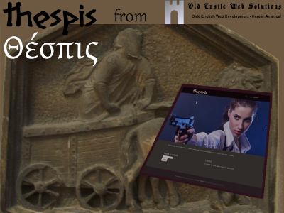

# Thespis
Thespis is a fully responsive theme for Wordpress. It is an adaptation of my basic Qohelet theme, designed for a client who is an actor. The Qohelet theme itself was built on the shoulders of giants, utilizing a number of other technologies, such as: 1. The Quark starter theme by Anthony Horton. 2. Quark is in turn built upon Underscores by Automattix. 3. Quark utilizes Normalize, Modernizr and Options Framework. 4. Many other smaller amounts of other technologies have been incorporated, so that I did not re-invent the wheel.

## Version 0.2
Ironed out a few starter problems, and added the routine to require the installation of the simple responsive plugin.

## Version 0.1
The theme is set up.